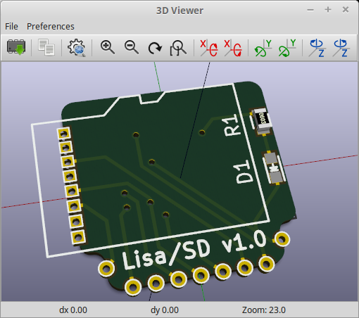
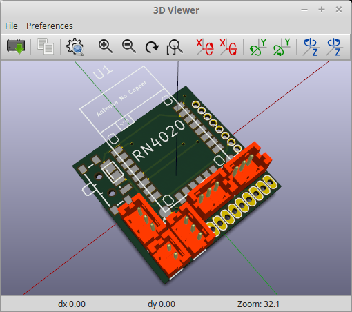

# helisa-hardware
Extension boards for the  "open source" autopilot.

## Lisa/SD
SD Card slot replaces superbit. Has pads to solder deltang R31 module (for RC).

## LisaShield
Easy connectors for Walkera Genius CP V2. Includes pads for Bluetooth transceiver which can be switched on/off by a slider. Solder bridge is available for permenent on.

